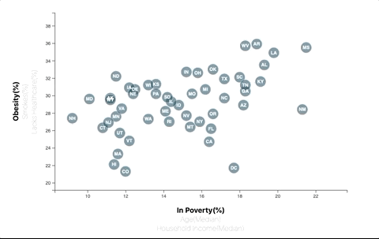

# D3-challenge

An interactive scatter plot was made to analyze health risks facing particular demographics

## Data

The data used is based on 2014 ACS 1-year estimates: https://factfinder.census.gov/faces/nav/jsf/pages/searchresults.xhtml.The current data set incldes data on rates of income, obesity, poverty, etc. by state. MOE stands for "margin of error."

## Features

* Interactive D3 Scatter plot

## Built with

* D3 

## Outcome 

Interactive scatter plot that correlate different health risks with poverty, age and household income

